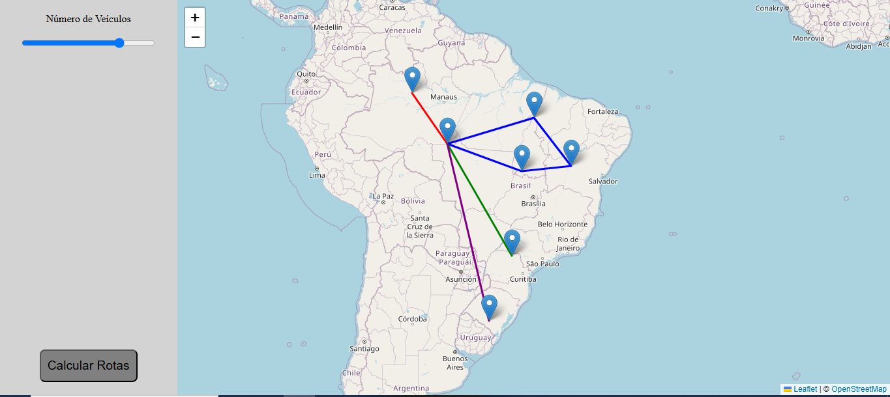

# Vehicle Routing Problem

This project consists of a FastAPI backend and vanillaJS frontend to solve the Vehicle Routing Problem and display the solution on a map. The user can select lat/long coordinates in a map and the number of vehicles available and give these inputs to [Google ORTools](https://developers.google.com/optimization/routing/vrp?hl=pt-br). The distances between each point are calculated "as the crow flies".



In order to start the FastAPI application first install the required python dependencies:

```bash
pip install -r backend/requirements.txt
```

then run:

```bash
fastapi run backend/app.py
```

